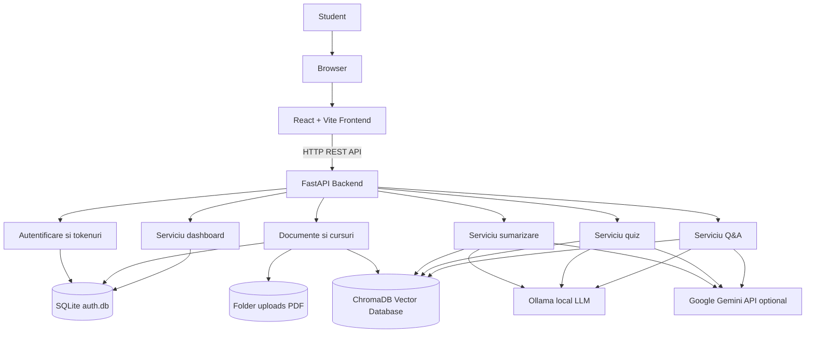

# Diagrama componentelor

Aceasta diagrama prezinta arhitectura componentelor principale ale aplicatiei.

```mermaid
flowchart TB
    Student[Student]
    Browser[Browser]
    Frontend[React + Vite Frontend]
    Backend[FastAPI Backend]

    Auth[Autentificare si tokenuri]
    Docs[Documente si cursuri]
    Summary[Serviciu sumarizare]
    Quiz[Serviciu quiz]
    Chat[Serviciu Q&A]
    Dashboard[Serviciu dashboard]

    SQLite[(SQLite auth.db)]
    Chroma[(ChromaDB Vector Database)]
    Uploads[(Folder uploads PDF)]
    Ollama[Ollama local LLM]
    Gemini[Google Gemini API optional]

    Student --> Browser
    Browser --> Frontend
    Frontend -->|HTTP REST API| Backend

    Backend --> Auth
    Backend --> Docs
    Backend --> Summary
    Backend --> Quiz
    Backend --> Chat
    Backend --> Dashboard

    Auth --> SQLite
    Docs --> SQLite
    Docs --> Uploads
    Docs --> Chroma
    Summary --> Chroma
    Summary --> Ollama
    Summary --> Gemini
    Quiz --> Chroma
    Quiz --> Ollama
    Quiz --> Gemini
    Chat --> Chroma
    Chat --> Ollama
    Chat --> Gemini
    Dashboard --> SQLite
```

