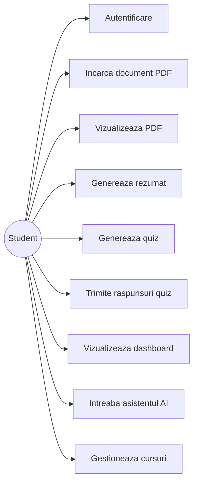
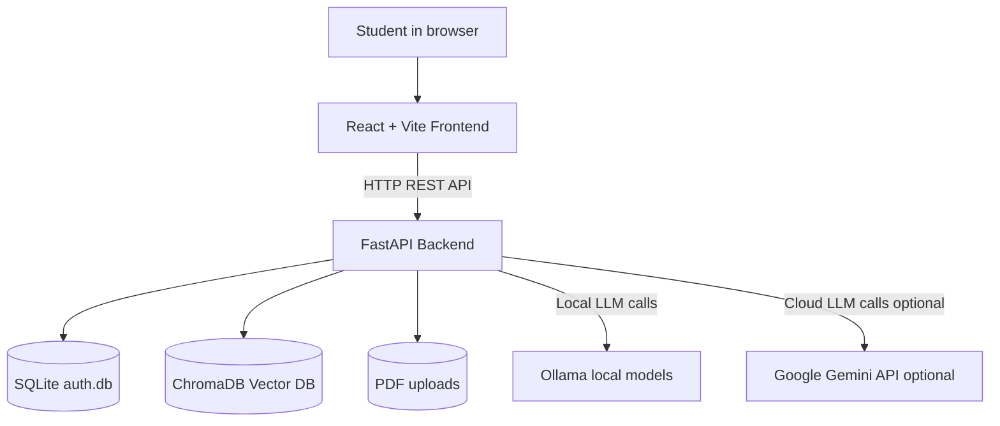
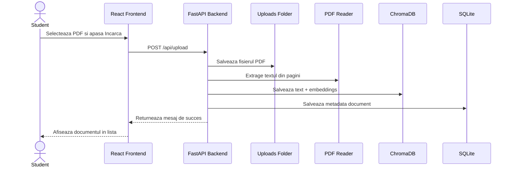
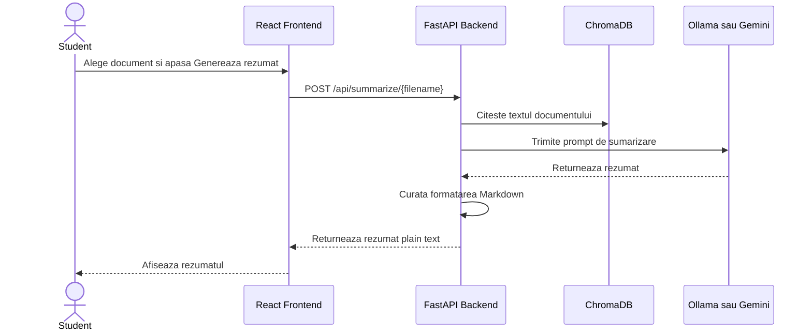
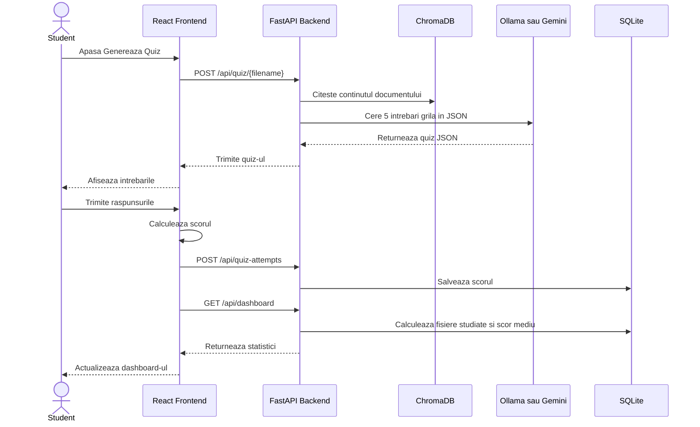
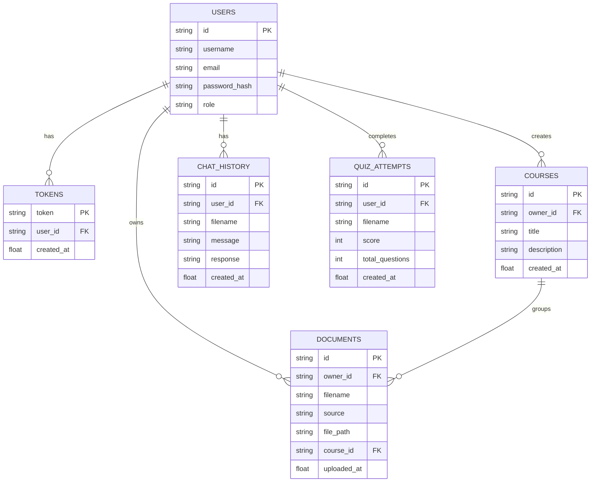

# Diagrame proiect Smart Study Hub

Acest document contine diagrame UML, arhitectura componentelor si workflow-uri pentru aplicatia Smart Study Hub.

## 1. Diagrama Use Case

Arata functionalitatile principale disponibile pentru un student.

## 2. Arhitectura componentelor

Arata componentele tehnice principale si modul in care comunica intre ele.

## 3. Workflow incarcare document PDF

Arata pasii prin care un PDF este incarcat, procesat si salvat pentru cautare ulterioara.

## 4. Workflow generare rezumat

Arata cum este generat rezumatul pentru un document incarcat.

## 5. Workflow quiz si dashboard

Arata cum se genereaza un quiz, cum este salvat scorul si cum se actualizeaza dashboard-ul.

## 6. Model simplificat de date

Arata entitatile principale persistate in SQLite.

