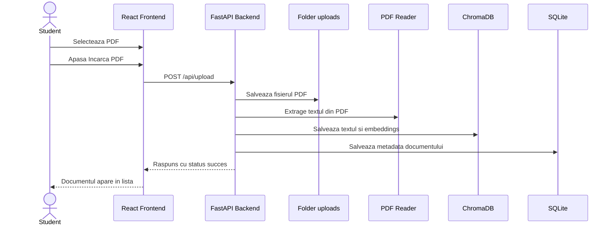
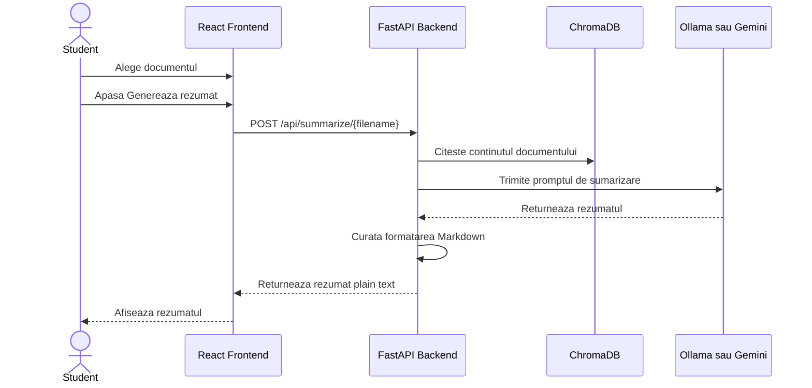
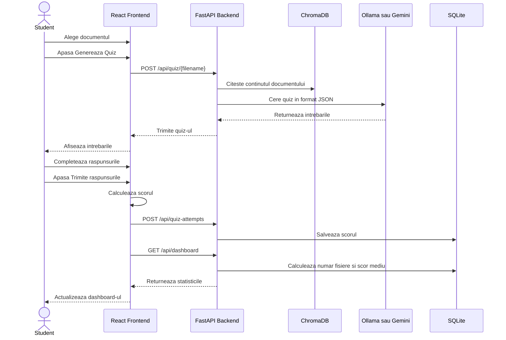
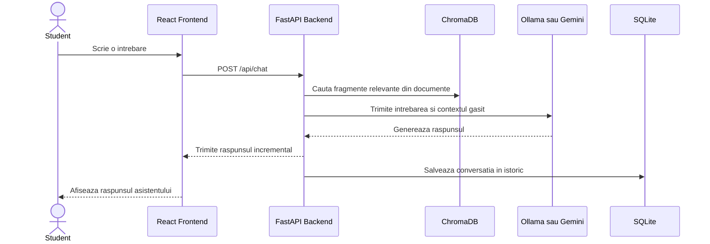

# Diagrame de secventa

Aceste diagrame arata fluxurile principale din aplicatie.

## 1. Incarcare document PDF

## 2. Generare rezumat

## 3. Generare quiz si actualizare dashboard

## 4. Intrebare catre asistentul AI

