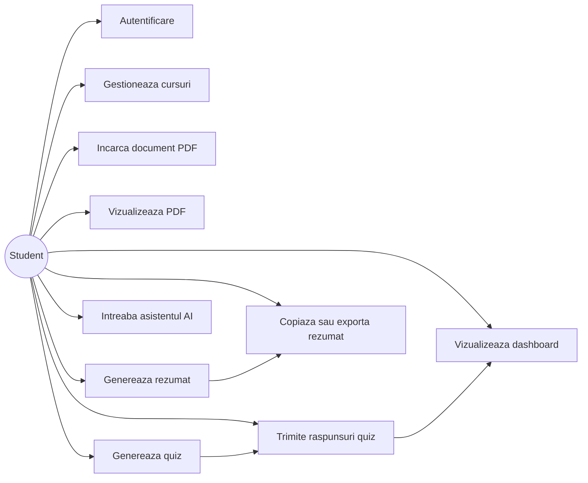

# Diagrama Use Case

Aceasta diagrama arata functionalitatile principale pe care le poate folosi un student in aplicatia Smart Study Hub.

```mermaid
flowchart LR
    Student((Student))

    Login[Autentificare]
    ManageCourses[Gestioneaza cursuri]
    UploadPDF[Incarca document PDF]
    ViewPDF[Vizualizeaza PDF]
    GenerateSummary[Genereaza rezumat]
    GenerateQuiz[Genereaza quiz]
    SubmitQuiz[Trimite raspunsuri quiz]
    ViewDashboard[Vizualizeaza dashboard]
    AskAI[Intreaba asistentul AI]
    ExportSummary[Copiaza sau exporta rezumat]

    Student --> Login
    Student --> ManageCourses
    Student --> UploadPDF
    Student --> ViewPDF
    Student --> GenerateSummary
    Student --> GenerateQuiz
    Student --> SubmitQuiz
    Student --> ViewDashboard
    Student --> AskAI
    Student --> ExportSummary

    GenerateQuiz --> SubmitQuiz
    SubmitQuiz --> ViewDashboard
    GenerateSummary --> ExportSummary
```

